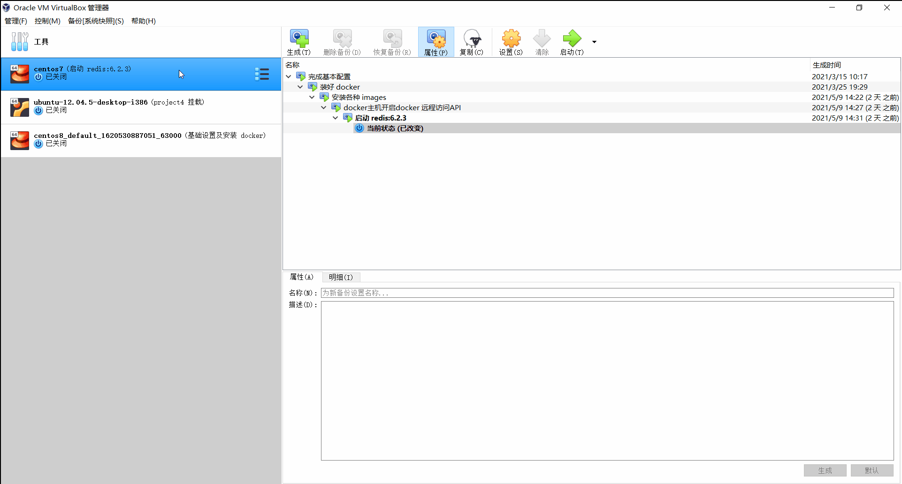
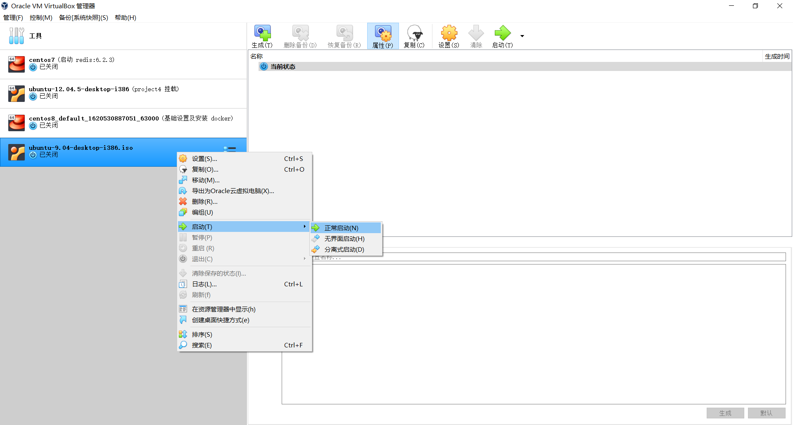
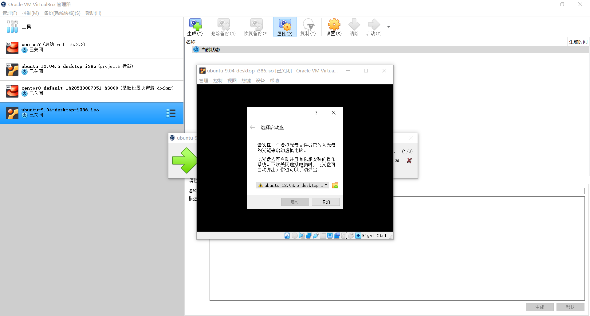
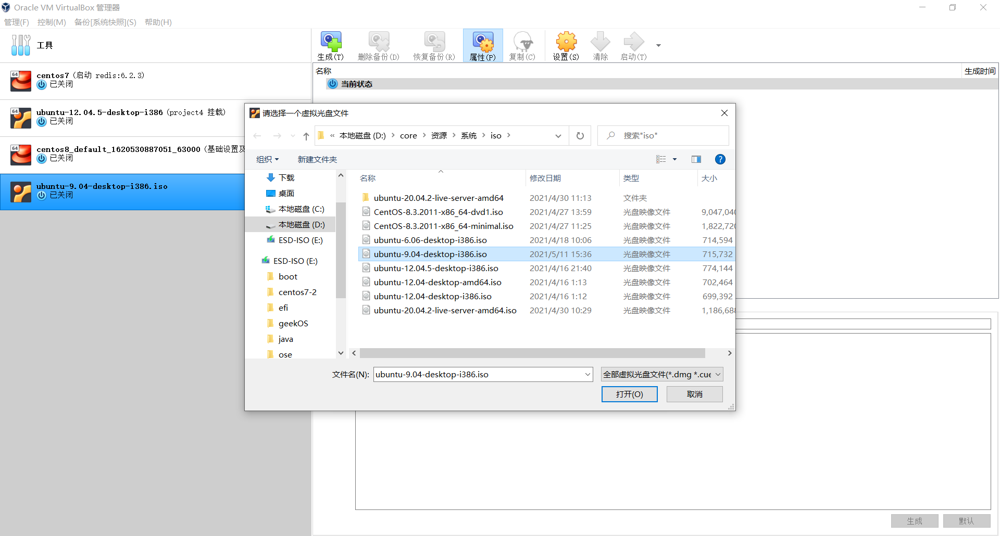
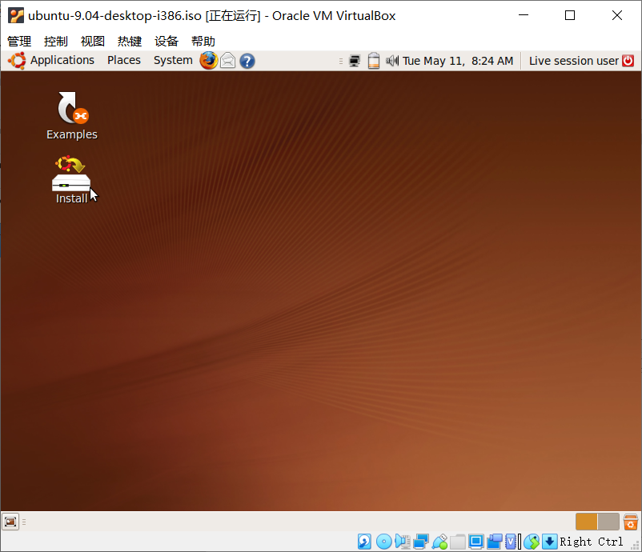
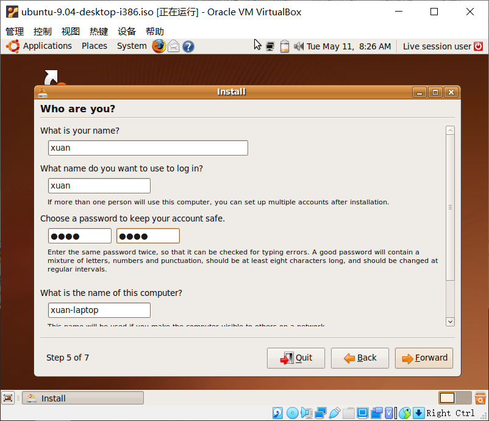
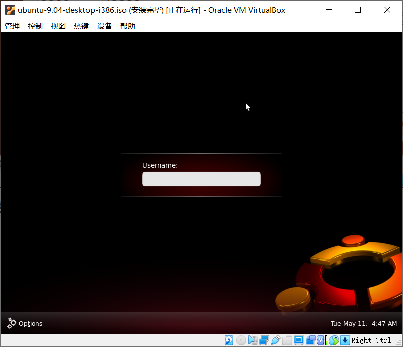
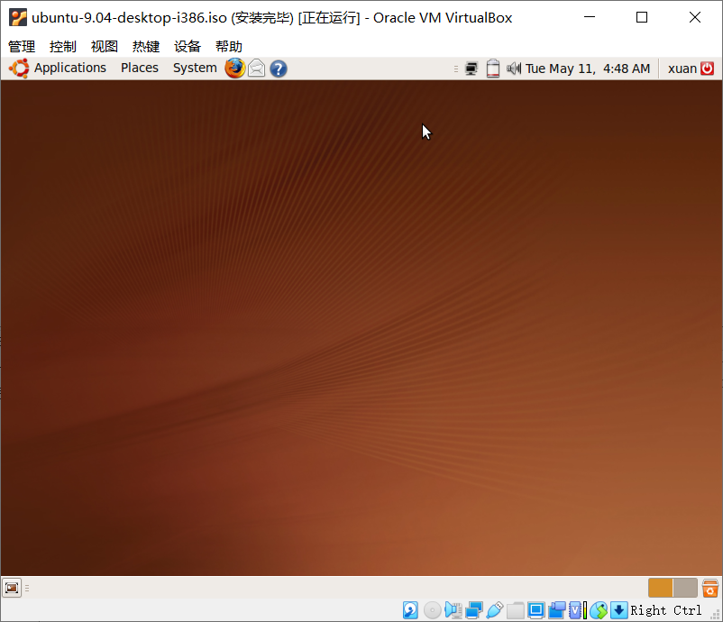

# 资料下载

- ubuntu-9.04-desktop-i386.iso [下载页面](http://old-releases.ubuntu.com/releases/9.04/) | [直接下载](http://old-releases.ubuntu.com/releases/9.04/ubuntu-9.04-desktop-i386.iso) 
- virtualbox-6.1.18 [下载页面](https://www.virtualbox.org/wiki/Download_Old_Builds_6_0) | [直接下载](https://download.virtualbox.org/virtualbox/6.0.18/VirtualBox-6.0.18-136238-Win.exe) 

# 创建虚拟机

侧边栏**工具** → **新建** → 输入名字、选择放置虚拟机的文件夹 → 版本选择 `Ubuntu (32-bit)` 

剩下的直接无脑 next

## 启动

## 刷入盘片

刷入盘片后选择启动

## 选择英文

对于界面的语言选择询问，建议直接选择英文

## 安装

### install

直接双击 Install，除了账号密码，剩下的一路 next 即可。然后就是静静等待，如果卡住了，多按几次回车

### 输入账号密码

这里我的账号密码都是 `xuan` 

### 安装完毕

输入账号密码后即可进入操作系统，这里我的账号密码都是 `xuan`

桌面如下

# 环境安装

