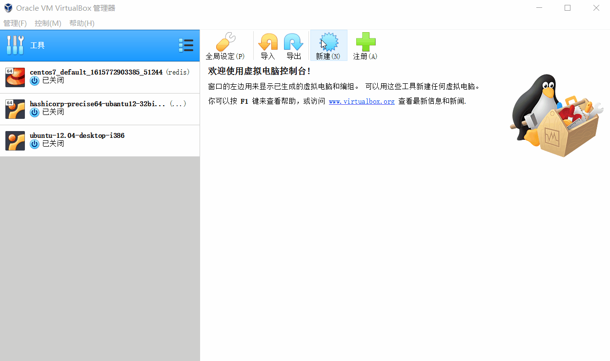
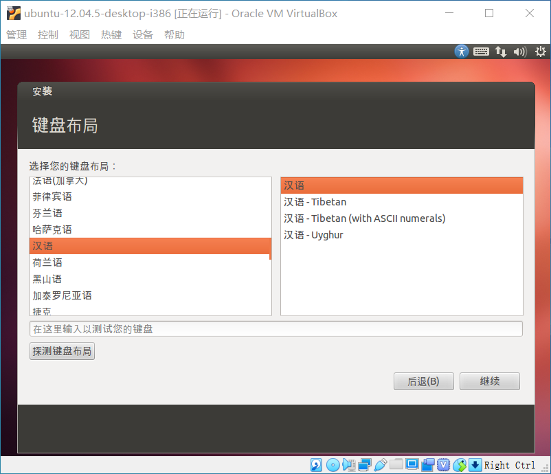

# 资料下载

- ubuntu-12.04.5-desktop-i386.iso [下载页面](http://releases.ubuntu.com/12.04/) | [直接下载](http://releases.ubuntu.com/12.04/ubuntu-12.04.5-desktop-i386.iso) 
- virtualbox-6.0.12 [下载页面](https://www.virtualbox.org/wiki/Download_Old_Builds_6_0) | [直接下载](https://download.virtualbox.org/virtualbox/6.0.12/VirtualBox-6.0.12-133076-Win.exe) 

# 新建




# 启动


# 刷入盘片


# 启动设置





之后就是漫长的等待，下载语言包慢的要死

# 进入


# root

## 打开命令行


# virtualBox 设置增强功能粘贴和拖放


## 关机


## 参考

 [virtualBox 设置增强功能粘贴和拖放 - nickchou - 博客园.html](references\virtualBox 设置增强功能粘贴和拖放 - nickchou - 博客园.html) 

# 其他设置

## 右键在当前位置打开终端

```sh
sudo apt-get install nautilus-open-terminal
nautilus -q
# 最后重启
```

## 取消键盘独占


