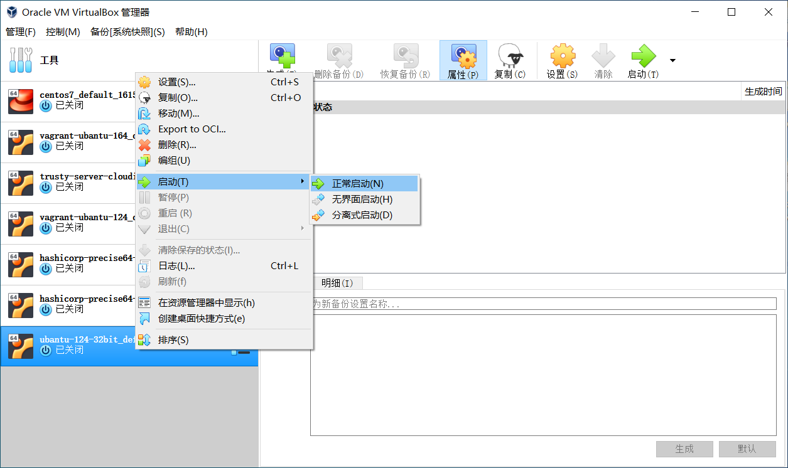
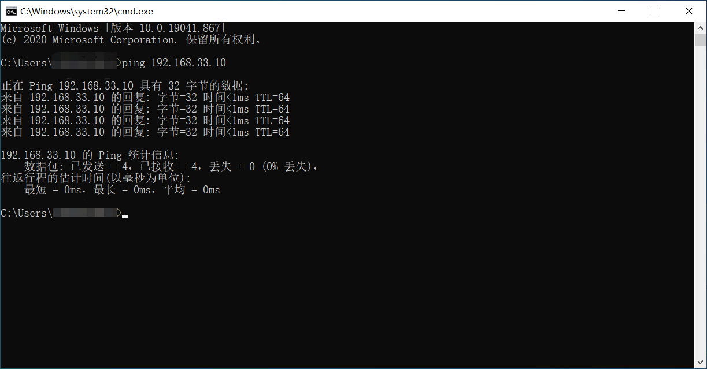
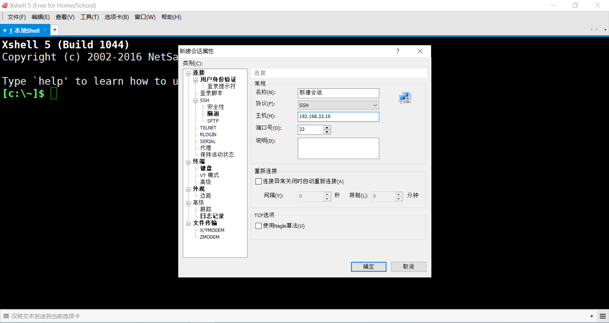
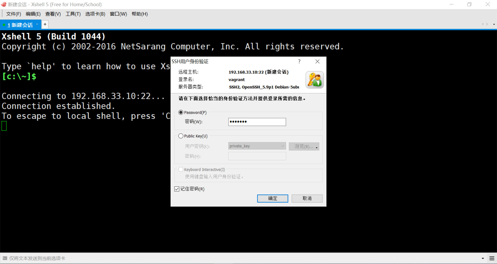

---
tags:
- OS
- 课内
- geekOS
---

## 材料准备

- virtualbox-6.0.12 [下载页面](https://www.virtualbox.org/wiki/Download_Old_Builds_6_0) | [直接下载](https://download.virtualbox.org/virtualbox/6.0.12/VirtualBox-6.0.12-133076-Win.exe) 
- vagrant-2.2.5 [下载页面](https://releases.hashicorp.com/vagrant/) | [直接下载](https://releases.hashicorp.com/vagrant/2.2.5/vagrant_2.2.5_x86_64.msi) 
- ubantu-12.04-32bit [下载页面](https://app.vagrantup.com/hashicorp/boxes/precise32) | [直接下载](https://app.vagrantup.com/hashicorp/boxes/precise32/versions/1.0.0/providers/virtualbox.box) 

## 说明

这里我们使用 **vagrant + virtualbox** 安装 `ubantu-12.04-32bit` 。为什么要用 `ubantu-12.04-32bit` ? 因为 `geekos-0.3.0` 非常古老，用现在操作系统的 gcc 编译，因为版本过高，会报错，所以我们需要降低版本，而且还要用 `32bit` 的操作系统。可不可以用最新版呢？可以是可以，但容易出问题。对于明知道有坑还要去踩的，我劝，这位，年轻人，好自为之，好好反思，不要再犯这样的聪明，小聪明，啊

## 虚拟机安装

### virtualbox与vagrant

先装 **virtualbox-6.0.12**、**vagrant-2.2.5** 直接无脑 next ，这里没什么好讲的

### ubantu-12.04-32bit

下载好 **ubantu-12.04-32bit** 之后，你会看到一个名为 **7f853ec0-ce79-4576-8b1e-54ba7fdc0099** 的二进制文件，这是正常的，看到这个名字不要觉得自己下错了，它就是这样的

#### 安装

只需三步，虚拟机即可安装完毕：

##### cd D:\vm\ubantu-12.4-32bit

随便找个目录，这里我选择的目录是 `D:\vm\ubantu-12.4-32bit` ，这个目录将存放虚拟机。打开 cmd ，cd 到 `D:\vm\ubantu-12.4-32bit` 

##### vagrant init ubantu-12.4-32bit

> initializes a new Vagrant environment by creating a Vagrantfile

在`D:\vm\ubantu-12.4-32bit` 目录下执行初始化操作：

```
vagrant init ubantu-12.4-32bit
```

然后你会看到 `D:\vm\ubantu-12.4-32bit\Vagrantfile` 

##### vagrant box add 

虚拟机的本地导入，将虚拟机导入到 `virtualbox` 。这里有一个地方需要灵活变通一下，即下面双引号引起来的路径。我的 `7f853ec0-ce79-4576-8b1e-54ba7fdc0099` 下载到了 `D:\7f853ec0-ce79-4576-8b1e-54ba7fdc0099` 所以我的命令如下所示：

```
vagrant box add ubantu-12.4-32bit "D:\7f853ec0-ce79-4576-8b1e-54ba7fdc0099"
```

值得注意的是，路径需要带上双引号。如果你的路径之中有空格，Windows 将会识别错误，带上双引号可以避免这个问题。要是还不行，建议像我一样，把 `7f853ec0-ce79-4576-8b1e-54ba7fdc0099` 放到 `D:` 盘下，这样就不会出错了

执行完三步，虚拟机即安装完毕！

#### 验证

安装完毕后，登录虚拟机验证一下

##### 启动虚拟机

在虚拟机目录 `D:\vm\ubantu-12.4-32bit` 下执行：

```
vagrant up
```

这里需要说明一下，你要打开哪个虚拟机，就要 cd 到哪个虚拟机所在的目录

##### 登录

启动完毕后，在虚拟机目录 `D:\vm\ubantu-12.4-32bit` 下执行：

```
vagrant ssh
```

##### whoami

输入 `whoami` ，出现 `vagrant` 验证完毕

#### 安装日志

 [ubantu-12.4-32bit.log](log\ubantu-12.4-32bit.log) 

## ubantu-12.04-32bit 的一些设置与说明

### virtualbox 中启动

使用 `vagrant up` 启动与在 virtualbox 中启动时一样的，你可以在 virtualbox 中直接启动



### 私有网络配置

#### 开启

在打开`D:\vm\ubantu-12.4-32bit\Vagrantfile` 为文本文件，在第 35 行（版本不同，可能行数有差异）有`config.vm.network`：

```
# config.vm.network "private_network", ip: "192.168.33.10"
```

去掉注释符号 `#` ，改成

```
config.vm.network "private_network", ip: "192.168.33.10"
```

然后，在`D:\vm\ubantu-12.4-32bit` 下执行命令`vagrant reload` 重新加载虚拟机配置

执行完上述操作，虚拟机已经了开启私有网络（Private network），只有主机可以访问虚拟机，如果多个虚拟机设定在同一个网段也可以互相访问，当然虚拟机是可以访问外部网络的

#### ping

启动虚拟机，打开 `cmd`  输入：

```
ping 192.168.33.10
```



### root 

对于一个菜鸡来说，直接使用 root 用户进行操作，无疑是一个明智的选择

#### 设置 root

登录虚拟机，执行：

```
sudo passwd root
```

然后输入密码即可，这里我输入的密码为 `root`

### 安装图形界面

#### 更新 apt-get 

```
apt-get update
```

#### 安装图形界面

我提供的官方镜像时没有图形界面的，所以要手动安装一个图形界面

```
sudo apt-get install ubuntu-desktop
```

然后再在命令行输入 `startx` 即可

# 虚拟机连接工具

## 命令行工具 Xshell

### 材料准备

### 启动 Xshell 连接

如果你能够 ping 通虚拟机，那么你可以使用 Xshell 进行连接，打开 Xhsell 后新建会话，输入三个数据：

- 地址：192.168.33.10
- 账号：vagrant
- 密码：vagrant

之后你就可以使用虚拟机了，不用再 cd 到虚拟机目录。如果你设置了 `root` 用户，建议你用 `root` 用户登录






## 文件传输工具 WinSCP


