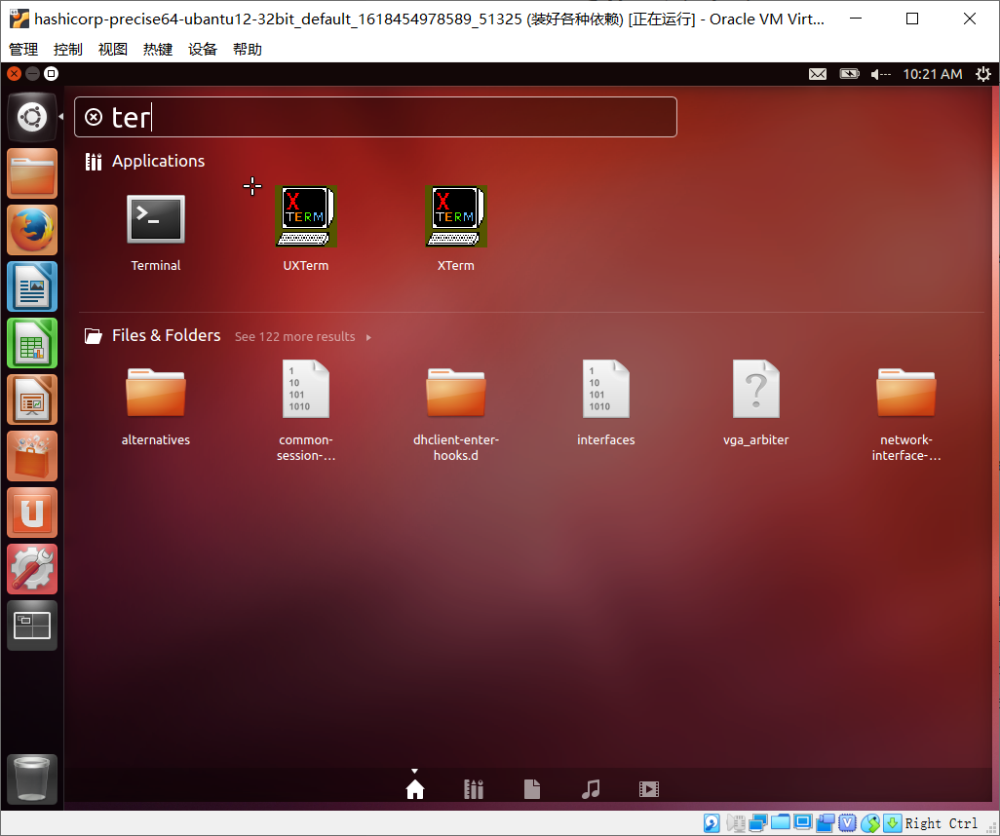
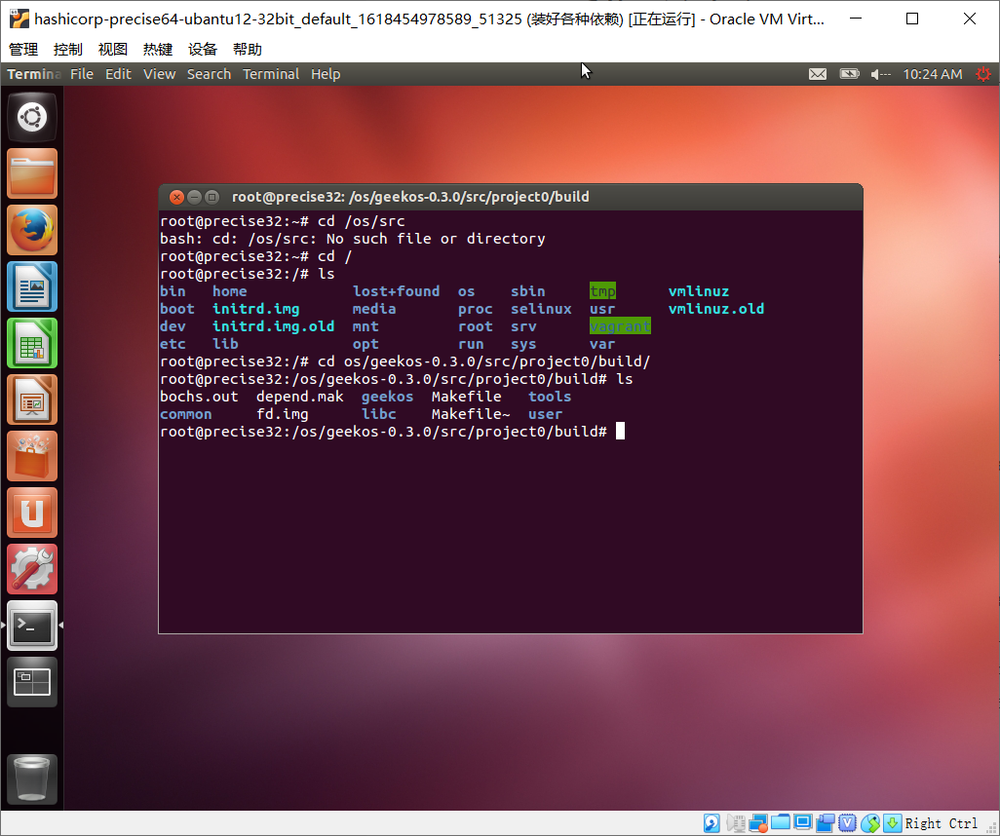
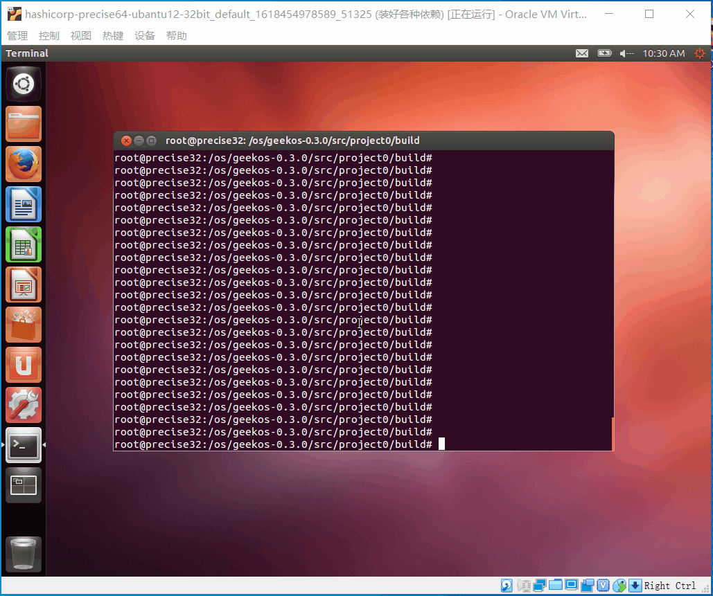
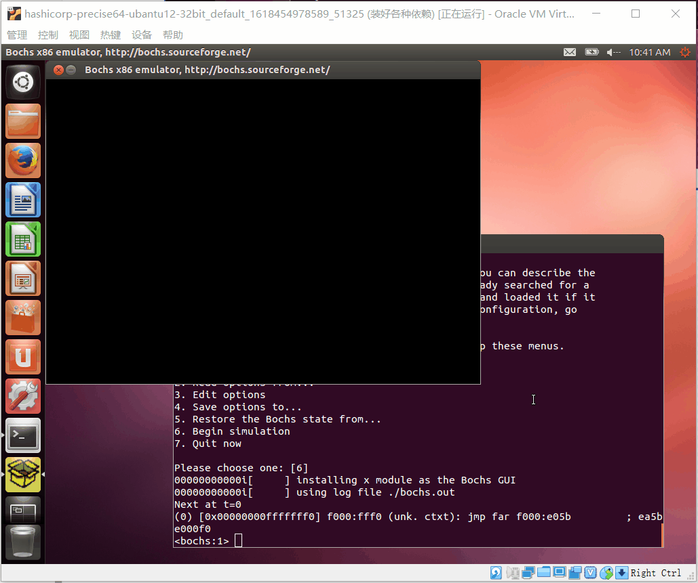

---
tags:
- OS
- 课内
- geekOS
---

# [虚拟机准备](虚拟机准备.md) 

## 虚拟机要求

- ubantu 
- 12.04
- 32bit
- 有图形界面

## 文件传输工具

可以传输文件到虚拟机

# 材料准备

- nasm-2.00  [下载页面](https://www.nasm.us/pub/nasm/releasebuilds/2.00/) | [直接下载](https://www.nasm.us/pub/nasm/releasebuilds/2.00/nasm-2.00.tar.gz) 

- bochs-2.5 [下载页面](https://bochs.sourceforge.io/) | [直接下载](https://sourceforge.net/projects/bochs/files/bochs/2.5/bochs-2.5.tar.gz/download) 

- geekos-0.3.0.zip [官网]( http://geekos.sourceforge.net/)

  将以上三个材料放到 虚拟机 `ubantu-12.04-64bit` 位置随意，我放在 `/os`

# 环境准备

## vim

原有的 vim-common 组件有问题，使用 vi 编辑文件时，编辑状态下按上下左右键变成 ABCD，而且这个版本没有 vim，所以我们安装 vim ，以后所有 vi 都用 vim 代替,下面是安装 vim：

```sh
apt-get install vim
```

其实不安装也可以，这里要编辑的文件也就 [Makefile](data\Makefile) 、 [.bochsrc](data\.bochsrc) 两个，我已经编辑好了，直接覆盖就行

## 各种依赖

```sh
sudo apt-get install build-essential xorg-dev libgtk2.0-dev
```

## nasm-2.00

cd 到 `nasm-2.00.tar.gz` 所在目录

```sh
tar -zxvf nasm-2.00.tar.gz
cd nasm-2.00/
./configure
# 编译安装
make clean && make && make install
```

## bochs-2.5

cd 到 `bochs-2.5.tar.gz` 所在目录

```sh
tar -zxvf bochs-2.5.tar.gz
cd bochs-2.5/
# 配置参数打开调试功能开关
./configure --enable-debugger --enable-disasm
# 编译安装
make clean && make && make install
```

执行 `bochs` ，出现下面的东西为安装成功：

```
root@precise32:/os/bochs-2.5# bochs
========================================================================
                        Bochs x86 Emulator 2.5
             Built from SVN snapshot, on November 27, 2011
                  Compiled on Apr 15 2021 at 10:12:01
========================================================================
00000000000i[     ] reading configuration from .bochsrc
00000000000e[     ] .bochsrc:469: ataX-master/slave CHS set to 0/0/0 - autodetection enabled
------------------------------
Bochs Configuration: Main Menu
------------------------------

This is the Bochs Configuration Interface, where you can describe the
machine that you want to simulate.  Bochs has already searched for a
configuration file (typically called bochsrc.txt) and loaded it if it
could be found.  When you are satisfied with the configuration, go
ahead and start the simulation.

You can also start bochs with the -q option to skip these menus.

1. Restore factory default configuration
2. Read options from...
3. Edit options
4. Save options to...
5. Restore the Bochs state from...
6. Begin simulation
7. Quit now

Please choose one: [6] 7
00000000000i[CTRL ] quit_sim called with exit code 1
root@precise32:/os/bochs-2.5# 

```

# project0 正式开始

解压 `geekos-0.3.0.zip` ，进入到 `project0`

## Makefile

`project0/build/Makefile` 的两处修改

### bug1

因为 Makefile 中默认的编译选项过于严格，把警告都当成错误来看待。在 Makefile的 第 **149** 行删除行末的 `-Werror `

### bug2

因为gcc在编译时开启了栈保护，所以要关闭栈保护。修改第148行。

```c
GENERAL_OPTS := -O -Wall -fno-stack-protector $(EXTRA_C_OPTS)
```

### 修改后的 Makefile 

 [Makefile](data\Makefile) 

## 修改 .bochsrc

修改`project0/build/.bochsrc`，把第4行注释掉

```
# vgaromimage: /export/home/daveho/linux/bochs-2.0.2/share/bochs/VGABIOS-lgpl-latest
```

修改第5行为

```
romimage: file=$BXSHARE/BIOS-bochs-latest
```

把第16、18、22行注释掉

```
# floppy_command_delay: 500 
# ips:  1000000 
# newharddrivesupport: enabled=1
```

#### 修改后的 .bochsrc

 [.bochsrc](data\.bochsrc) 

## 正式启动

### 打开命令行



### cd 到 project0/build/



### bochs

在 **project0/build/** 下执行 `bochs` ，选择 **6. Begin simlation**，回车



### 黑框处理

弹出的bochs窗口黑屏，可能是进入了调试模式，在终端中输入 `c`  回车即可




# 参考

 [bochs的安装_kuang_tian_you的博客-CSDN博客_bochs安装.html](references\bochs的安装_kuang_tian_you的博客-CSDN博客_bochs安装.html) 

 [操作系统课设-初试GeekOS_几何木偶-CSDN博客.html](references\操作系统课设-初试GeekOS_几何木偶-CSDN博客.html) 

 [在ubuntu 命令行下如何打开图形界面-CSDN论坛.html](references\在ubuntu 命令行下如何打开图形界面-CSDN论坛.html) 


