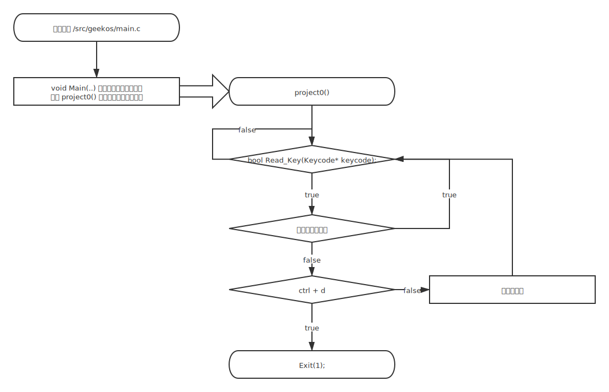
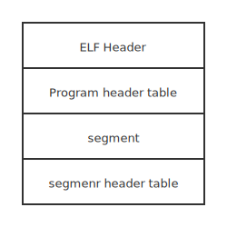
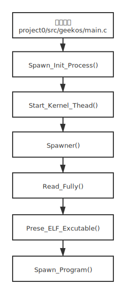
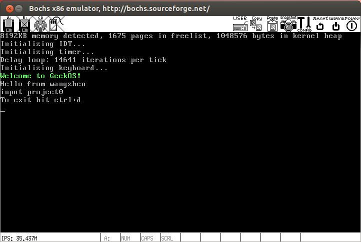
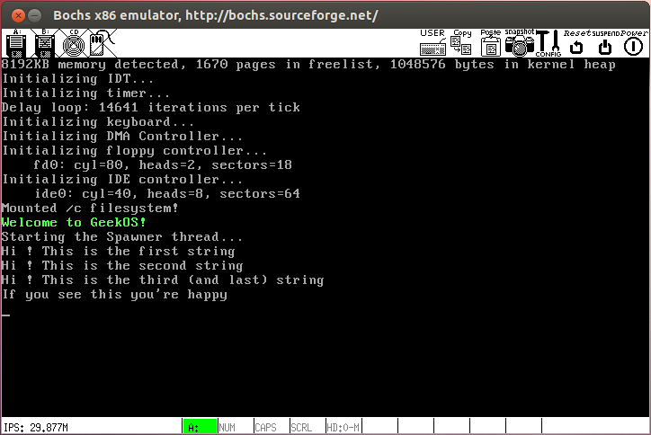

# 绪论

## GeekOS操作系统概述

## 课程设计的目的与任务

## 系统开发环境和技术简介

# 系统分析

## GeekOS实验项目开发环境的搭建

### 虚拟机准备

这里我们选择 [virtualbox-6.0.12](https://download.virtualbox.org/virtualbox/6.0.12/VirtualBox-6.0.12-133076-Win.exe) + [ubuntu-9.04-desktop-i386.iso](http://releases.ubuntu.com/releases/.pool/ubuntu-9.04-desktop-i386.iso) 搭建实验环境。根据我的亲身体会，不建议使用其他版本，否则会出现各种在 9.04 下不会出现的错误。此外，安装过程十分漫长，请耐心等待。

### 环境搭建

1. 由于系统年代久远，其自带的软件包列表已不可用，因此我们需要更新软件包列表：sudo apt-get update 
2. 下载安装 build-essential 包：sudo apt-get intall build-essential 
3. 安装 NASM：sudo apt-get install nasm 
4. 安装 Bochs：sudo apt-get install bochs && sudo apt-get install bochs-x 

## 项目分析

### 项目0——Geek0S系统环境调试及编译

实验内容是设计一个键盘操作函数，编程实现一个内核进程。该进程的功能是：接受键盘输入的字符并显示在屏幕上，当按 ctrl+d 时，结束进程的运行

### 项目1——内核级线程设计及实现

熟悉ELF文件格式，了解GeekOS系统如何将ELF格式的可执行程序装入到内存，建立内核进程并运行的实现技术。在此项目中，GeekOS需要从磁盘加载一个可执行文件到内存中，并且在内核线程中执行此程序。我们需要做的就是完成 project0/src/geekos/elf.c 中 Parse_ELF_Executable 函数，把EXE文件的内容填充到指定的 Exe_format 格式的区域。

### 项目2——用户级进程的动态创建和执行

### 项目3——线程调度算法和信号量功能实现

# 系统设计与实现

## 项目设计流程图和原理

### 项目0——Geek0S系统环境调试及编译

启动 geekOS 后调用 Start_Kernel_Thread，创建了一个接受键盘输入的字符并显示在屏幕上的内核进程 proect0。proect0 循环调用Read_Key()，读取键码后，判断是否是ctrl+d，若是则退出；否则输出接收到的字符到屏幕，然后继续调用Read_Key()监听。

### 项目1——内核级线程设计及实现

在计算机科学中，是一种用于二进制文件、可执行文件、目标代码、共享库和核心转储格式文件。是UNIX系统实验室（USL）作为应用程序二进制接口（Application Binary Interface，ABI）而开发和发布的，也是Linux的主要可执行文件格式。其格式如下：

geekOS 启动后进入启动函数 Main()，Main() 中由 Spawn_Init_Process() 函数调用 Start_Kernel_Thread()，以Spawner()函数为进程体建立一个内核态进程，并放入就绪队列。 Spawner函数运行过程为：通过Read_Fully函数将ELF可执行文件读入内存缓冲区；通过Parse_ELF_Executable函数解析ELF文件， 并通过Spawn_Program函数执行ELF文件。

### 项目2——用户级进程的动态创建和执行

### 项目3——线程调度算法和信号量功能实现

# 系统测试及编译运行

## 系统编译运行的原理

### 项目0——Geek0S系统环境调试及编译

总的来说，就是启动 geekOS 后调用 Start_Kernel_Thread，创建了一个接受键盘输入的字符并显示在屏幕上的内核进程，其细节如下：

- Keycode Wait_For_Key(void)：project0/src/geekos/keyboard.c 中实现了函数 Keycode Wait_For_Key(void) ，它的功能是循环等待一个键盘事件，然后返回一个16位的 Keycode。此外，在 project0/src/geekos/keyboard.h 中定义了所有的键盘代码。
- bool Read_Key(Keycode* keycode)：project0/src/geekos/keyboard.c 中实现了函数 bool  Read_Key(Keycode* keycode) ，它的功能是轮询键盘事件，如果捕获到键盘事件，则返回 true，并且将按键码保存到参数 keycode 地址中，否则返回 false。
- Start_Kernel_Thread： project0/src/geekos/kthread.c 定义了 Start_Kernel_Thread，它的功能是建立一个内核线程。它需要一个 Thread_Start_Func 类型的函数指针作为参数，参数 Start_Func 指向的代码为进程体生成一个内核进程
- Thread_Start_Func ：project0/src/geekos/kthread.h 中定义了 Typedef void (*Thread_Start_Func) (ulong_t,arg); 该函数指针指向一个无返回值、参数为 ulong_t 类型的函数。与 Start_Kernel_Thread 配合使用，指向的代码为进程体生成一个内核进程

在 project0 中，Thread_Start_Func 就是我们自己编写的接受键盘输入字符并显示在屏幕上的函数 project0() 。

### 项目1——内核级线程设计及实现

在此项目中，GeekOS需要从磁盘加载一个可执行文件到内存中，并且在内核线程中执行此程序。我们需要做的就是完成 project0/src/geekos/elf.c中 Parse_ELF_Executable 函数，把EXE文件的内容填充到指定的Exe_format格式的区域。

在 project0/include/geekos/elf.h 中，我们可以找到 elfHeader、elfHeader 、Exe_Segment 和 Exe_Format 的定义。掌握 ELF 的各个结构后程序就很容易了。

在 project0/src/geekos/elf.c 中，我们实现 int Parse_ELF_Executable(char *exeFileData, ulong_t exeFileLength,struct Exe_Format *exeFormat) 。其各参数含义如下：

- exeFileData：已装入内存的可执行文件所占用空间的起始地址       
- exeFileLength：可执行文件长度       
- exeFormat：保存分析得到的elf文件信息的结构体指针根据ELF文件格式，用户可以从exeFileData指向的内容中得到ELF文件头，继续分析可以得到程序头，程序代码段等信息

具体实现见代码。

geekOS 启动后， 程序就会运行到 project0/src/geekos/lprog.c 下的 void Spawner( unsigned long arg )。Spawner() 程序中会读取并运行 /c/a.exe ，此 .exe 文件由 project0/src/user/a.c 编译而来。执行 /c/a.exe 的过程中，会在屏幕输出两句话："Hi ! This is the first string\n" 和 "Hi ! This is the second string\n" 。/c/a.exe 运行完毕后回到 Spawner()  ，然后再 Print 两句："Hi ! This is the third (and last) string\n" 和 "If you see this you're happy\n"，到此，程序结束。

### 项目2——用户级进程的动态创建和执行 

### 项目3——线程调度算法和信号量功能实现

## 系统编译运行的结果及分析说明

### 项目0——Geek0S系统环境调试及编译

启动 geekOS，按下 input project0 ，屏幕上随着键盘按下而显示字符，这说明接受键盘输入的字符并显示在屏幕上的功能已实现。按下 crtl+d 后，键盘按下，屏幕无反应，这说明进程已结束运行

### 项目1——内核级线程设计及实现

geekOS 启动后， 程序就会运行到 project0/src/geekos/lprog.c 下的 void Spawner( unsigned long arg )。Spawner() 程序中会读取并运行 /c/a.exe ，此 .exe 文件由 project0/src/user/a.c 编译而来。执行 /c/a.exe 的过程中，会在屏幕输出两句话："Hi ! This is the first string\n" 和 "Hi ! This is the second string\n" 。/c/a.exe 运行完毕后回到 Spawner()  ，然后再 Print 两句："Hi ! This is the third (and last) string\n" 和 "If you see this you're happy\n"，到此，程序结束。

屏幕打印了/c/a.exe 中的 "Hi ! This is the first string\n" 和 "Hi ! This is the second string\n" ，并且a.exe 运行完毕后回到 Spawner()，Print 两句："Hi ! This is the third (and last) string\n" 和 "If you see this you're happy\n" ，说明内核级线程成功执行

### 项目2——用户级进程的动态创建和执行

### 项目3——线程调度算法和信号量功能实现

## 遇到的问题及解决方法

# 心得体会

